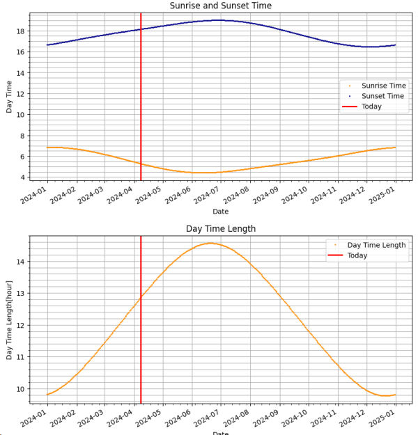

# CalcDaytime
Calculate daytime lentgh all through the year.

## 説明

日の出🌅、日の入🌇、日中の長さ🌞などを計算して可視化するサンプルプログラムです。

本サンプルは [Google Colab](https://colab.research.google.com/) で開発しました。

サンプルアプリを [Mercury Cloud](https://cloud.runmercury.com/) で公開しています。

サンプルアプリのURLは次のとおりです。

https://daytime.runmercury.com/app/sample

### ライブラリ

サンプルアプリでは、主に以下の Python ライブラリを使用しています。

* 天文計算ライブラリ： [PyEphem](https://rhodesmill.org/pyephem/)
* アプリ化ライブラリ： [Mercury](https://github.com/mljar/mercury)

### 構成ファイル

サンプルアプリを構成するファイル（※Mercury Cloudへアップロードするファイル）は以下のとおりです。

* パッケージ管理ファイル： [requirements.txt](requirements.txt)
* Jupyter Notebookファイル： [sample.ipynb](sample.ipynb)

## 参照
* https://cloud.runmercury.com/
* https://runmercury.com/docs/
* https://docs.runmercury.com/app/checkbox
* https://rhodesmill.org/pyephem/
* https://github.com/mljar/mercury
* https://qiita.com/gmoriki/items/665426c88b0662403443
* https://qiita.com/DoroDango/items/269c74d091ef6b94b9ab
* https://eco.mtk.nao.ac.jp/koyomi/dni/dni15.html
* http://zakii.la.coocan.jp/physics/22_sunrise_circle.htm
